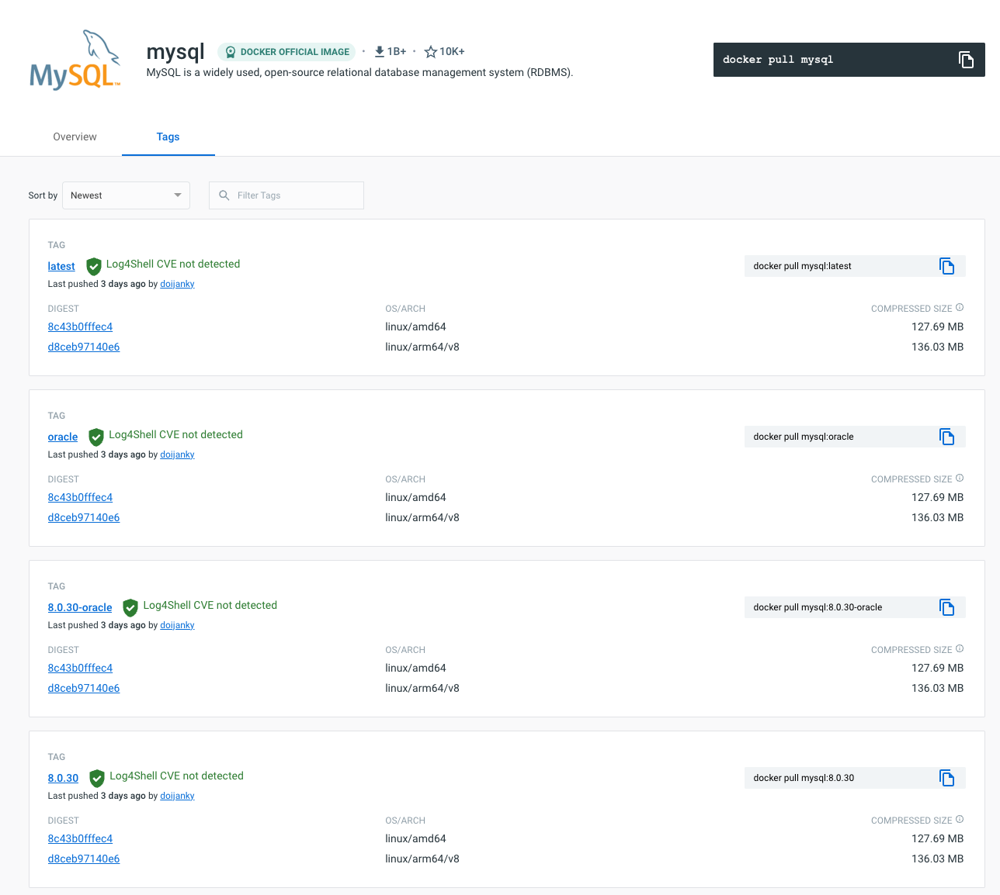
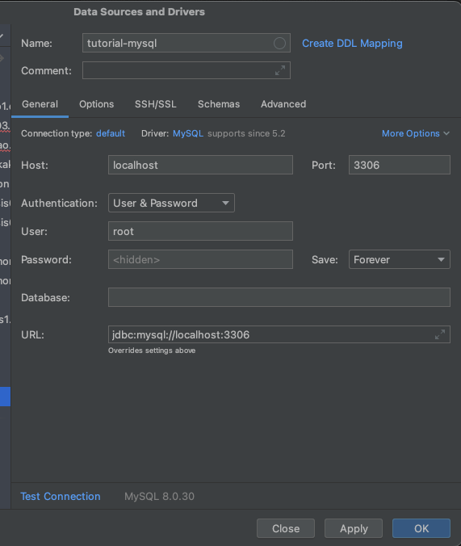

# 데이터베이스 설치

도커를 활용해서 mysql 데이터베이스를 설치해보겠다. 도커허브를 방문해서 공식 이미지를 확인해보자. 최신 이미지인 8.0.30를 설치해보자.



도커데스크탑이 설치되었다는 가정하에 아래의 커맨드로 설치 및 실행을 할 수 있다. -v 옵션의 /Users/sonjeong-ug/kakao/data/tutorial-mysql 부분의 본인이 데이터베이스가 저장이 되는 디렉토리를 경로를 저장한다.
```
$ docker pull mysql:8.0.30
$ docker run --name tutorial-mysql -v /Users/sonjeong-ug/kakao/data/tutorial-mysql:/var/lib/mysql -e MYSQL_ROOT_PASSWORD=1234 -d -p 3306:3306 mysql:8.0.30
```  
>-v 옵셥은 volume을 의미합니다. 외부 호스트의 디스크를 내부의 논리적인 디스크의 영역에 쓸수 았게 합니다.  
>-p 옵션은 포트바인딩을 의미합니다. 즉 도커 이미지 내부의 포트를 외부로 호스트 머신의 포트로 바인딩합니다.

실행이 정상적으로 되었는지 아래의 명령어로 확인을 해보자. 설치가 잘 되었다면 아래와 같이 docker 프로세스가 잘 구동되어 있다는 것을 확인할 수 있다.

```
$ docker ps
CONTAINER ID   IMAGE          COMMAND                  CREATED         STATUS         PORTS                               NAMES
63ef63bd5d7e   mysql:8.0.30   "docker-entrypoint.s…"   6 seconds ago   Up 6 seconds   0.0.0.0:3306->3306/tcp, 33060/tcp   tutorial-mysql
```

클라이언트 툴에서 데이터베이스를 접속해보자. 이번엔 인텔리제이의 데이터베이스툴을 활용하자.  
인텔리제이의 데이터베이스툴은 오른쪽 사이드 바의 메뉴를 통해서 접근이 가능하고, 창이 열리면 + 버튼을 이용하여 데이터소스를 추가해보자.



정상적으로 추가되었다면 쿼리 브라우저를 열어서 테스트들을 수행해보자.


