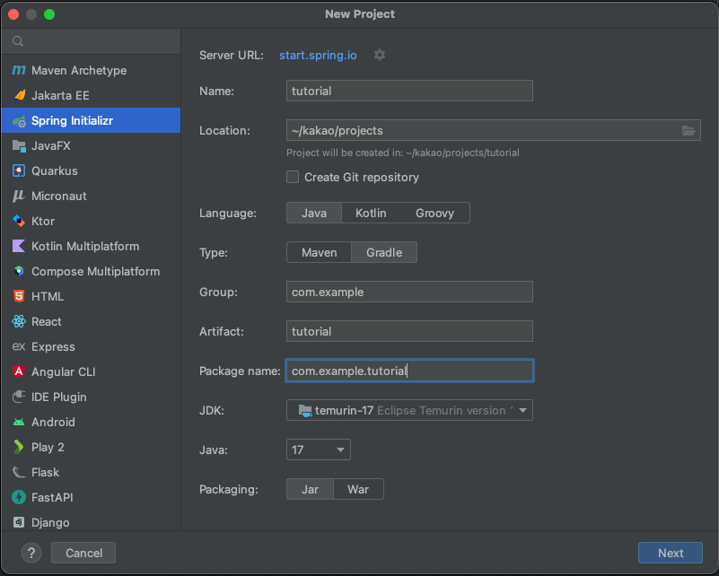
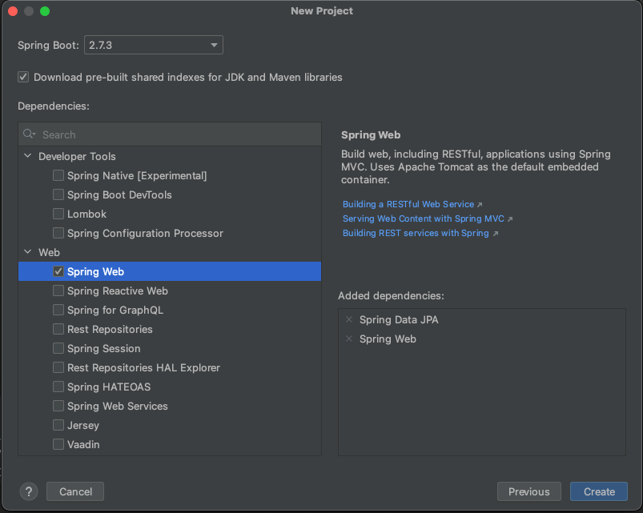

# 스프링부트 환경설치
## 프로젝트 생성하기
Spring Intializer를 이용해서 스프링 부트를 설치해보자. 웹사이트를 이용해서 설치를 하는 방법이 있지만 인텔리제이를 사용하고 있고, 스프링 플러그인이 있다면 인텔리제이에서 바로 생성이 가능하다.  
File > New > Project로 메뉴를 통해서 아래와 같이 설정해보자.



다음으로 Spring Web과 Spring Data JPA의 디펜던시를 추가한다.



## Data JPA 설정
프로젝트가 생성되면 바로 실행을 시켜보자.

```
Description:

Failed to configure a DataSource: 'url' attribute is not specified and no embedded datasource could be configured.

Reason: Failed to determine a suitable driver class


Action:

Consider the following:
	If you want an embedded database (H2, HSQL or Derby), please put it on the classpath.
	If you have database settings to be loaded from a particular profile you may need to activate it (no profiles are currently active).
```

Data JPA에 적합한 드리이버와 설정이 되어있지 않다는 의미이다. 우리는 mysql을 사용할 것이므로 mysql에 관련된 설정을 해보자.
먼저 resources 폴더에 application.yml 파일을 추가하고 아래와 같이 설정한다.

```yaml
spring:
  datasource:
    driver-class-name: com.mysql.cj.jdbc.Driver
    username: root
    password: 1234
    url: jdbc:mysql://localhost:3306/board
  jpa:
    hibernate:
      ddl-auto: update
    show-sql: true
```

그리고 디펜던시에 mysql driver를 디펜던시에 추가한다.  
https://mvnrepository.com/ 로 가서 mysql로 검색해서 데이터베이스 버전에 맞는 드라이버를 확인하고 gradle 파일에 다음과 같이 디펜던시를 추가한다.

```groovy
dependencies {
    implementation 'org.springframework.boot:spring-boot-starter-data-jpa'
    implementation 'org.springframework.boot:spring-boot-starter-web'
    testImplementation 'org.springframework.boot:spring-boot-starter-test'
    implementation 'mysql:mysql-connector-java:8.0.30'
}
```

여기까지 정상적으로 설정되다면 어플리케이션을 시작해보면 오류없이 실행된다.


