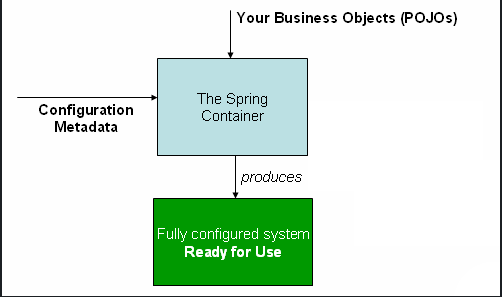
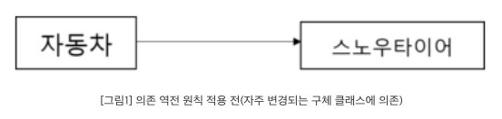
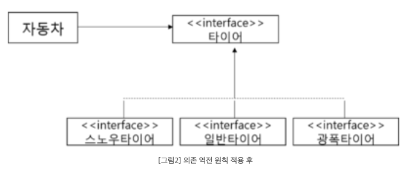

# 스프링의 3대 핵심 요소

IoC - Inversion of Control  
AOP - Aspect Oriented Programming  
PSA - Portable Service Abstraction

# IoC

원래 기본적으로 프로그래밍을 한다면 제어권은 일반적으로 사용하는 클래스에 명시하게 되어 있다.

```java
public class MemberController {
    private MemberRepository memberRepository = new MemberRepository();
}
```

하지만 스프링에서는 스프링 컨테이너에 Bean이라는 객체를 관리하며, Bean들 사이의 디펜던시를 관리해준다.

```java
public class MemberController {
    private MemberRepository memberRepository;
}
```



# IoC와 DIP

그러면 무엇이 좋아지는 건가? SOLID 원칙에서 DIP를 준수할 수 있게 된다. 그러면 또 DIP(Dependency Inversion Principle)는 무엇인가?

1. 상위 모듈은 하위 모듈에 의존해서는 안된다
2. 추상화는 세부 사항에 의존해서는 안된다  
   => 의존 관계를 맺을 때 변화하기 쉬운 것에 의존하기보다는, 변화하지 않는 것에 의존하라는 원칙!





# Interface의 중요성

객체지향에서 가장 중요한 것은 객체의 행위와 협력. 그런데 많은 사람들이 착각하는게 속성이 중요하다고 생각하는 것 그러다보면 객체 지향을 지키기 어려워진다. Interface는 행위만 있다.

# Bean

설정 메타데이터의 의해서 생성한 스프링 컨테이너가 관리하는 객체  
스프링이 처음 나왔을때는 xml 설정 파일에 빈을 등록하는 방법으로는 설정 파일에 명시 지금은 거의 쓰지 않음

```xml
<beans>
    <bean id="myService" class="com.acme.services.MyServiceImpl"/>
</beans>
```

이후에는 Java-based Container Configuration이라는 방식이 나오고 요즘은 주로 이 방식을 많이 사용함

```java
@Configuration
public class AppConfig {

    @Bean
    public MyService myService() {
        return new MyServiceImpl();
    }
}
```

Annotation-based Container Configuration이 가장 흔하게 사용하는 방식임.  
@Component 스프링이 관리하는 가장 일반적인 스테레오 타입이며, @Service, @Controller, @Repository등의 특정한 유스케이스에 사용하는 특별한 스테레오 타입들도 제공.


# DI

Constructor-based Dependency Injection, Setter-based Dependency Injection 두 가지가 있다.

## Constructor-based Dependency Injection

```java
public class ThingOne {

    public ThingOne(ThingTwo thingTwo, ThingThree thingThree) {
        // ...
    }
}
```

```xml
<beans>
    <bean id="beanOne" class="x.y.ThingOne">
        <constructor-arg ref="beanTwo"/>
        <constructor-arg ref="beanThree"/>
    </bean>

    <bean id="beanTwo" class="x.y.ThingTwo"/>

    <bean id="beanThree" class="x.y.ThingThree"/>
</beans>
```

## Setter-based Dependency Injection

```java
public class ExampleBean {

    private AnotherBean beanOne;

    private YetAnotherBean beanTwo;

    private int i;

    public void setBeanOne(AnotherBean beanOne) {
        this.beanOne = beanOne;
    }

    public void setBeanTwo(YetAnotherBean beanTwo) {
        this.beanTwo = beanTwo;
    }

    public void setIntegerProperty(int i) {
        this.i = i;
    }
}
```

```xml
<bean id="exampleBean" class="examples.ExampleBean">
    <!-- setter injection using the nested ref element -->
    <property name="beanOne">
        <ref bean="anotherExampleBean"/>
    </property>

    <!-- setter injection using the neater ref attribute -->
    <property name="beanTwo" ref="yetAnotherBean"/>
    <property name="integerProperty" value="1"/>
</bean>

<bean id="anotherExampleBean" class="examples.AnotherBean"/>
<bean id="yetAnotherBean" class="examples.YetAnotherBean"/>
```

# PSA

서비스의 기능을 접근하는 방식 자체를 일관되게 유지하면서 기술 자체를 유연하게 사용할 수 있도록 하는 것을 PSA(일관된 서비스 추상화)라고 합니다.

PSA는 환경의 변화와 관계없이 일관된 방식의 기술로의 접근 환경을 제공하는 추상화 구조이다. 다시 말해 하나의 추상화로 여러 서비스를 묶어둔 것을 Spring에서 PSA라고 한다.  

PSA가 필요한 이유 어떤 서비스를 이용하기 위한 접근 방식을 일관된 방식으로 유지함으로써 애플리케이션에서 사용하는 기술이 변경되더라도 최소한의 변경만으로 변경된 요구 사항을 반영하기 위함이며 PSA를 통해서 애플리케이션의 요구 사항 변경에 유연하게 대처할 수 있다.

SpringData가 가장 큰 PSA의 예이다.
