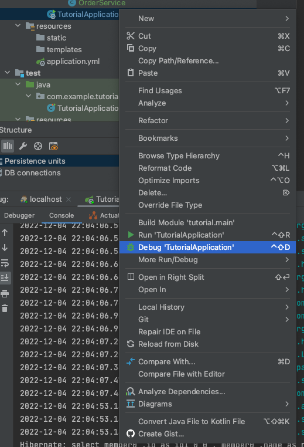
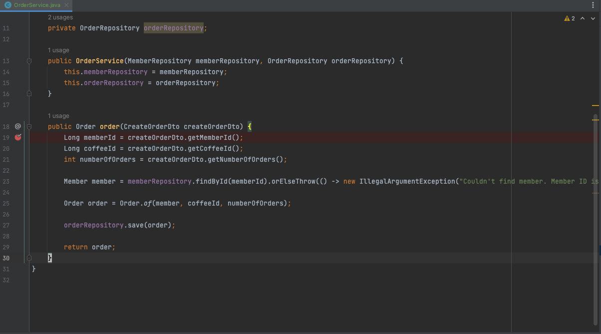
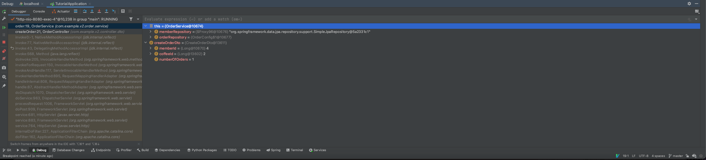

# Debugging

어쩌면 개발에 IDE의 가장 필수적인 기능. 인텔리제이를 기반으로 살펴보자.

## Debug로 실행하기

## BreakPoint 잡기

에디터에서 라인넘버 오른쪽의 공백을 클릭함으로써 break point로 등록/해제가 된다.

## Debugging 해보기 

이제 어떠한 요청이 브레이크 포인트를 만나면 진행이 중단되고, 디버깅을 할 수 있다.

현재 객체의 정보 및 인자(Arguments)의 정보들을 확인할 수 있고, expression을 통해 직접 메소드를 실행할수도 있다.

Step Over(F8)로 다음 줄로 진행할 수도 있으며, Step Into(F7)로 해당 메소드 안으로 들어가서 디버깅을 이어갈 수도 있다.

