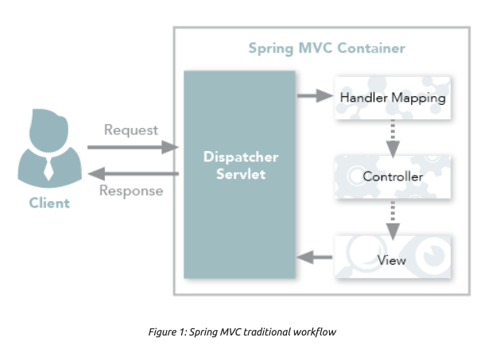
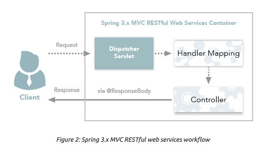

# Spring MVC

Spring MVC는 다른 웹 프레임워크들처럼 프론트 컨트롤러 패턴으로 설계되어 잇다.
DispatcherServlet이라는 중앙의 서블릿이 요청을 처리하고, 설정된 컴포넌트들에게 요청을 위임한다.

## Request Mapping과 Handler Methods

결국 핵심은 RequestMapping이다.

설명이 너무 길어질 수 있으므로 공식문서로 대체한다.

[Request Mapping](https://docs.spring.io/spring-framework/docs/current/reference/html/web.html#mvc-ann-requestmapping)

[Handler Methods](https://docs.spring.io/spring-framework/docs/current/reference/html/web.html#mvc-ann-methods)

## 결론은

모든 매핑의 기능을 사용할 필요는 없다. 본인의 HTTP API의 규칙을 정비하고, 일관성있게 매핑을 사용하면 된다. API 형식도 일관되게 구성해보자.

