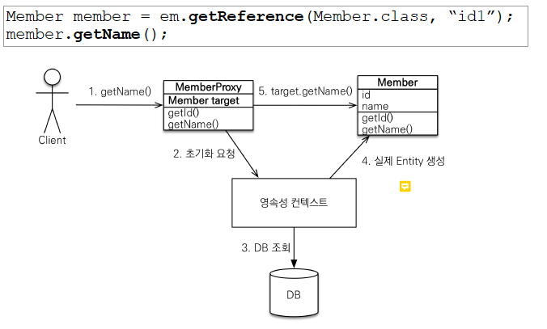

# Lazy Loading vs Eager Loading

## Lazy Loading

연관 객체를 나중에 로딩
실제 객체를 가지고 올떄, select문이 실행된다.

```java
    @ElementCollection(fetch = FetchType.LAZY)
    @CollectionTable(
            name = "order_item_v4",
            joinColumns = @JoinColumn(name = "order_id")
    )
    private List<OrderItem> items;
```

```
Hibernate: select order0_.order_id as order_id1_6_0_, order0_.created_at as created_2_6_0_, order0_.order_status as order_st3_6_0_ from order_v4 order0_ where order0_.order_id=?
Hibernate: select items0_.order_id as order_id1_3_0_, items0_.menu_id as menu_id2_3_0_, items0_.order_quantity as order_qu3_3_0_ from order_item_v4 items0_ where items0_.order_id=?^^
```

## Eager Loading

엔티티를 조회할 떄 연관된 엔티티도 함께 조회.
조인을 통해서 한꺼번에 객체를 로딩한다.


```java
    @ElementCollection(fetch = FetchType.EAGER)
    @CollectionTable(
            name = "order_item_v4",
            joinColumns = @JoinColumn(name = "order_id")
    )
    private List<OrderItem> items;
```

```
Hibernate: select order0_.order_id as order_id1_6_0_, order0_.created_at as created_2_6_0_, order0_.order_status as order_st3_6_0_, items1_.order_id as order_id1_3_1_, items1_.menu_id as menu_id2_3_1_, items1_.order_quantity as order_qu3_3_1_ from order_v4 order0_ left outer join order_item_v4 items1_ on order0_.order_id=items1_.order_id where order0_.order_id=?
```

## 어떻게 이런 동작이 가능할까?

실제적으로 find로 찾아낸 객체는 프록시 객체가 반환된다.



- em.getReference()로 호출하여 프록시 객체가 반환
   (target에는 null이 들어가 있다)
- 실제 객체에 접근하는 member.getName()호출
- target이 null이기 때문에 영속성 컨텍스트에 요청
- 영속성 컨텍스트는 실제 DB에서 조회한 후 target에 실제 Entity를 연결
- 프록시 객체의 target을 통해 .getName() 호출됨

## 영속성 컨텍스트

## 어떤게 성능에 유리할까?

상황에 따라 다르다. 객체 전체 정보를 한꺼번에 조회하는 연산이 많다면 Eager, 각각의 부분 정보가 중요하다면 Lazy가 유리하지만 상황에 따라 달라서 단정짓기 힘들다.

## N+1 문제

쿼리 1번으로 N건을 가져왔는데, 관련 컬럼을 얻기 위해 쿼리를 N번 추가 수행하는 문제  
쿼리결과 건수마다 참조 정보를 얻기 위해 건수만큼 반복해서 쿼리를 수행하게 되는 문제  
DB쿼리 수행비용(횟수)이 크기 때문에, eager 로딩 등의 방법으로 해결하는 것이 권장됨