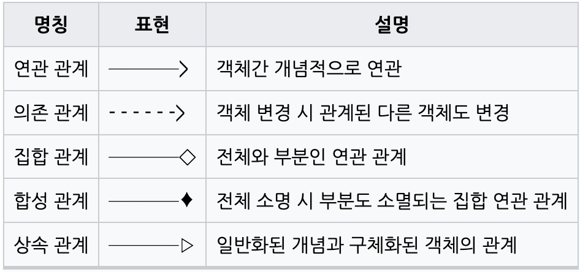

# Software engineering
## 폭포수 모델과 애자일 모델

폭포수 모델은 프로젝트 착수 시점에 전체적인 요구사항에 대한 분석, 설계, 개발, 통합테스트순으로 순차적으로 수행한다.   
애자일 모델에서는 분석, 설계, 개발, 테스트를 점진적이고 반복적으로 수행한다.


애자일 모델이 등장하게 된 계기는 불확실성이다. 요구사항은 한상 변경되기에 최근에는 애자일 모델이 대세를 이루고 있다.

## UML

Unified Modeling Language  
통합 모델링 언어. 알아 놓으면 좋지만 너무 사용법에 매몰되지 말자.

### 요구사항 명세

[기능요구사항]
- 기능 스팩 정의, 어떤 기능을 원하는지 기능 구현을 기술한다.

[비기능요구사항]
- 비기능 정책 정의, 기능이 아닌 제약, 정책 사항을 기술한다.

```
[기능요구사항]
1. 계정>권한관리 테이블 맨 우측에 '상태'열 추가하여 잠금/활성 상태를 표기한다.
2. 어드민 로그인 5회 실패시 상태가 활성->잠금으로 변경된다. (수정일시 변경 없음)
3. 잠금 상태로 변경된 경우에  해당 계정의 '보유권한'이 비활성(텍스트 회색처리, 권한 수정 불가) 처리된다.
4. 상태의 잠금을 클릭할 경우, 잠금해제 팝업이 오픈된다.
 
- 팝업 제목/내용/버튼: 잠금해제/로그인 잠금을 해제하시겠습니까?/ 취소 확인
- 잠금해제가 정상 반영된 경우에 '상태'가 다시 활성으로 변경되며, '보유권한' 또한 수정 가능하도록 복구된다. (수정일시 변경 있음)
 
[비기능요구사항]
- ROOT 계정만 권한관리 및 잠금 해제 처리가 가능하다.
- ROOT 계정에 의하여 권한이 모두 회수된 관리자는 권한관리 목록에 표시되지 않는다.
```

### 유스케이스 정의서와 다이어그램

유스케이스(use case)는 행위자(actor)가 관심을 가지고 있는 유용한 일을 달성하기 위한 시나리오의 집합을 명시한다


```

```
### 시퀀스 다이어그램

객체간의 상호작용을 순서로 나타내는 다이어그램


### 클래스 다이어그램

객체 타입을 정의하고, 그들 간의 존재하는 저적인 관계를 다양한 방식으로 표현한다.



