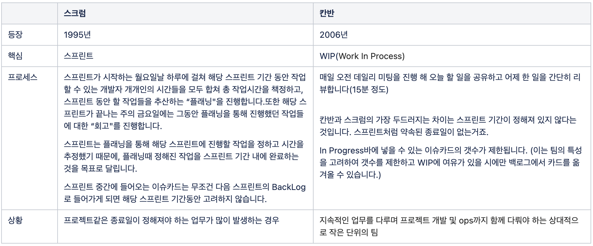

# 애자일

## 스크럼 vs 칸반



## 사용자 스토리

### INVEST

Independent - 독립적이다.  
Negotiable - 협상 가능하다.  
Valuable - 사용자와 고객에게 가치가 있다.  
Estimatable - 추정가능하다.  
Small - 작다.  
Testable - 테스트가능하다.  

### Independent

아래는 디펜던시가 있는 상황. 1번의 스토리에 2번 3번이 엮인다.

1. 기업은 채용 공고를 게시할 때 비자카드로 결제할 수 있다.
2. 기업은 채용 공고를 게시할 때 마스터카드로 결제할 수 있다.
3. 기업은 채용 공고를 게시할 때 아메리칸익스프레스카드로 결제할 수 있다.

의존성 있는 스토리는 합쳐거나 다른 방식으로 분할해보자.

1. 기업은 채용 공고를 게시할 때 한 종류의 신용카드로 결제할 수 있다.
2. 고객이 결제할 수 있는 신용카드는 두 종류가 더 있다.

### Negotiable

스토리는 꼭 구현해야 하는 계약서나 요구사항 정의서가 아니다. 세부사항은 고객과 개발팀이 협상해야 한다. 그럼에도 주요한 세부사항을 미리 알고 있다면 주석으로 덧붙이자.

```
기업은 채용공고를 게시할 때 신용카드로 결제할 수 있다.

주) 비자, 마스터, 아메리칸 익스프레스 카드를 지원한다.
```

스토리 카드 뒷면에는 세부사항을 테스트 형태로 바꿔서 기록하자.

```
비자, 마스터카드, 아메리칸익스프레스카드 테스트(통과)

다이너스클럽 카드 테스트(실패)

정상 카드 ID 테스트(통과)

비정상 카드 ID 테스트(통과)

분실카드 테스트(실패)

유효기간만료된 카드 테스트(실패)
```

### Valuable
꼭 그런건 아니지만, 고객에게 가치가 있도록 작성하자. 개발자에게만 가치가 있다고 생각하면 우선순위에서 밀릴수 있다.

1. 모든 데이터베이스 연결은 커넥션풀을 통해 이루어져야 한다.
2. 모든 에러 처리 및 로그 생성은 공통 클래스를 통해 이루어져야 한다.

위의 스토리를 아래와 같이 바꿔보자.

1. 사용자 50명까지 데이터베이스에 연결하여 사용할 수 있어야 한다.
2. 모든 에러는 사용자에게 보여야 하며, 일관된 형태로 로그로 기록되어야 한다.

### Estimatable
추정의 어려운 이유는 다음과 같다.

1. 해당 분야의 도메인 지식이 부족하다. => 학습해야 된다.
2. 기술적인 지식이 부족하다. => 접해보지 않는 기술이라면 한 두명의 개발자가 spike를 해서 추정가능하도록 습득해야 된다.
3. 스토리가 너무 크다. => 스토리를 쪼개고 에픽을 활용하자.

### Small

적당히 작아야 한다.

### Testable

스토리는 테스트 가능한 세부사항을 포함해야 한다. 테스트를 할 수 없다면 개발자가 언제 코딩을 그만 두어야 할 지 알 수 없다.

## 예시

User Story를 작성하는 형식은 아래와 같다.

“As a <role>,” “I want <function/goal/desire>,” and “so that <benefit>”

"사용자 역할은 목표/행위를 수행하여 이유를 한다. 

```
Story: User logging in
  As a customer
  I want to login with email and password
  So that I can get access to the site
```

```
Feature: User logging in
  As a customer
  I want to login with email and password
  So that I can get access to the site
  
Scenario: Logging in with invalid credentials
 Given I am at the Account/Login page
  When I fill the account email textbox with value 'incorrect@mail.com'
   And I fill the password textbox with value 'incorrectpassword'
   And I click the login button
  Then a text 'Can't login! Wrong email or password.' should appear in the validation errors region
  
Scenario: Logging in with valid credentials
 Given I am at the Account/Login page
  When I fill the account email textbox with value 'myname@mymail.com'
   And I fill the password textbox with value 'mypassword'
   And I click the login button
  Then I should be at the home page
```
