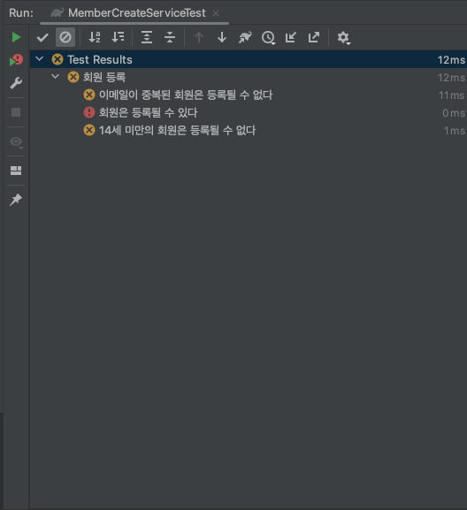

# TDD

Test Driven Development의 약자이다. 즉 테스트 주도 개발을 의미한다. 테스트를 먼저 정의하면서 개발을 진행한다.

## TDD vs BDD

차이가 있다면 TDD는 테스트 자체에 집중하여 테스트를 선정하는 반면, BDD는 비즈니스 요구사항에 집중하여 테스트 케이스를 선정한다는 것이다.  
“Behaviour” is a more useful word than “Test”  
BDD는 애자일하고 잘 맞는다. 특히 유저 스토리라 잘맞는다고 한다.

```
Story :
    고객은 회원 가입을 위해서 회원 정보를 제출하고 등록한다.
```

```
Feature :
    회원 등록
    
시나리오: 회원은 등록될 수 있다.
 Given 정확한 회원 정보 
 When 등록 시도
 Then 등록 성공
 
시나리오 : 만 14세 미만 회원은 등록 될 수 없다. 
 Given 생년월일이 현재 날짜 기준 13세인 생년월일을 포함한 회원 정보
 When 등록 시도
 Then AgeUnder14Exception 발생 
 
시나리오: 이메일이 중복된 회원은 등록될 수 없다.
 Given 기등록된 devsun@kakao.com을 포함한 회원 정보 
 When 등록 시도
 Then EmailDuplicatedException 발생
```

## Test 작성

먼저 아무 일도 하지 않는 서비스를 만들어보자. 서비스는 유저스토리 혹은 유스케이스 기준으로 하나의 역할만 하도록 작성하자.  
정답이 있는 건 아니지만 MemberService로 정의하는 케이스일 경우 테스트가 너무 길어지고, 하나의 클래스가 하는 역할이 너무 많아질 수 있다.

```java
public class MemberCreateService {
    public MemberCreateResponse create(MemberCreateRequest request) {
        return null;
    }
}
```

그리고 테스트 케이스를 작성해보자.

```java
@DisplayName("회원 등록")
class MemberCreateServiceTest {
    MemberCreateService memberCreateService = new MemberCreateService();

    @Test
    @DisplayName("회원은 등록될 수 있다")
    public void should_created_when_correct() {
        // given
        String name = "todd";
        LocalDate birthDate = LocalDate.of(1990, 11, 11);
        String email = "todd@kakao.com";

        MemberCreateRequest request = new MemberCreateRequest(
                name, email, birthDate
        );

        MemberCreateResponse expected = new MemberCreateResponse(
                2, name
        );

        // when
        MemberCreateResponse actual = memberCreateService.create(request);

        // then
        assertEquals(expected, actual);
    }

    @Test
    @DisplayName("14세 미만의 회원은 등록될 수 없다")
    public void should_throwAgeUnder14Exception_when_ageUnder14() {
        // given
        String name = "todd";
        LocalDate birthDate = LocalDate.now().minusYears(12);
        String email = "todd@kakao.com";

        MemberCreateRequest request = new MemberCreateRequest(
                name, email, birthDate
        );

        // when & then
        assertThrows(AgeUnder14Exception.class, () -> memberCreateService.create(request));
    }

    @Test
    @DisplayName("이메일이 중복된 회원은 등록될 수 없다")
    public void should_throwEmailDuplicatedException_when_duplicatedEmail() {
        // given
        String name = "todd";
        LocalDate birthDate = LocalDate.now().minusYears(15);
        String email = "duplicatin@kakao.com";

        MemberCreateRequest request = new MemberCreateRequest(
                name, email, birthDate
        );

        // when & then
        assertThrows(EmailDuplicatedException.class, () -> memberCreateService.create(request));
    }
}
```

테스트를 작성했으면 빠른 실패를 해보자.



## Test 케이스 메소드 작명법

1. 메서드명_테스트상태_기대결과
코드 리팩터링으로 인하여 메서드명이 변경되는 경우 테스트명 또한 변경되어야 하는데, 변경되지 않으면 나중에 이 TC를 이해하기 어렵게 되므로, 바람직하지 않다는 의견이 있다.  
isAdult_AgeLessThan18_False  
withdrawMoney_InvalidAccount_ExceptionThrown  
admitStudent_MissingMandatoryFields_FailToAdmit

2. 메소드명_기대결과_테스트상태
1번과 비슷한 형태이지만, 일부 개발자들은 이런 컨벤션을 사용할 것을 추천한다.   
이 컨벤션 또한 메서드명이 바뀌면 나중에 이해하기 어렵다는 단점이 있다.  
isAdult_False_AgeLessThan18  
withdrawMoney_ThrowsException_IfAccountIsInvalid   
admitStudent_FailToAdmit_IfMandatoryFieldsAreMissing  


3. test[테스트할 기능]
테스트할 기능이 테스트명의 일부로 사용되어 쉽게 읽을 수 있도록 해 준다.  
그러나 "테스트" 접두사가 중복된다는 주장도 있다. 그러나 일부 개발자들은 이러한 형태의 네이밍을 사용하는 것을 좋아한다.    
testIsNotAnAdultIfAgeLessThan18  
testFailToWithdrawMoneyIfAccountIsInvalid  
testStudentIsNotAdmittedIfMandatoryFieldsAreMissing


4. 테스트할 기능  
테스트 메서드를 식별하는 방법으로 주석을 사용하고 있기 때문에, 테스트할 기능만 간단하게 쓰는 것이 더 낫다는 의견이 많다.  
또한 코드의 악취를 방지하고, 문서화된 형태의 유닛 테스트를 수행하므로 권장되는 방법이다.
IsNotAnAdultIfAgeLessThan18  
FailToWithdrawMoneyIfAccountIsInvalid  
StudentIsNotAdmittedIfMandatoryFieldsAreMissing  


5. should_기대결과_When_테스트상태  
이러한 형태의 네이밍은 많은 사람들이 테스트에 대해 쉽게 이해할 수 있기 때문에 많이 사용된다.
should_ThrowException_When_AgeLessThan18  
should_FailToWithdrawMoney_ForInvalidAccount  
should_FailToAdmit_IfMandatoryFieldsAreMissing


6. when_테스트상태_Expect_기대결과  
When_AgeLessThan18_Expect_isAdultAsFalse  
When_InvalidAccount_Expect_WithdrawMoneyToFail  
When_MandatoryFieldsAreMissing_Expect_StudentAdmissionToFail  


7. given_사전조건_When_테스트상태_Expect_기대결과  
이러한 접근법은 행동 주도 개발(BDD)의 일부로 개발된 네이밍 컨벤션에 기초한다.     
이 아이디어는 테스트를 세개의 파트로 나누어 전제 조건, 테스트 상태, 기대 결과가 위 형식대로 네이밍되는 형태이다.  
Given_UserIsAuthenticated_When_InvalidAccountNumberIsUsedToWithdrawMoney_Then_TransactionsWillFail
