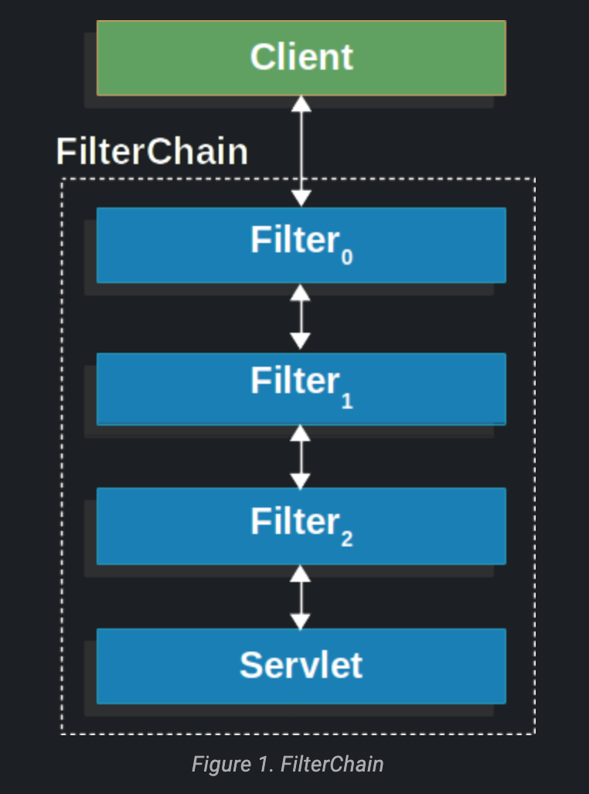
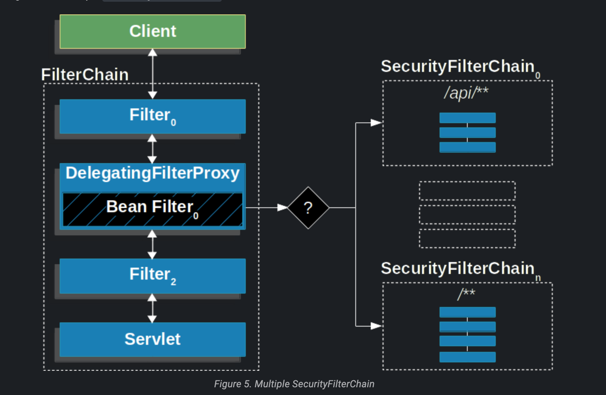
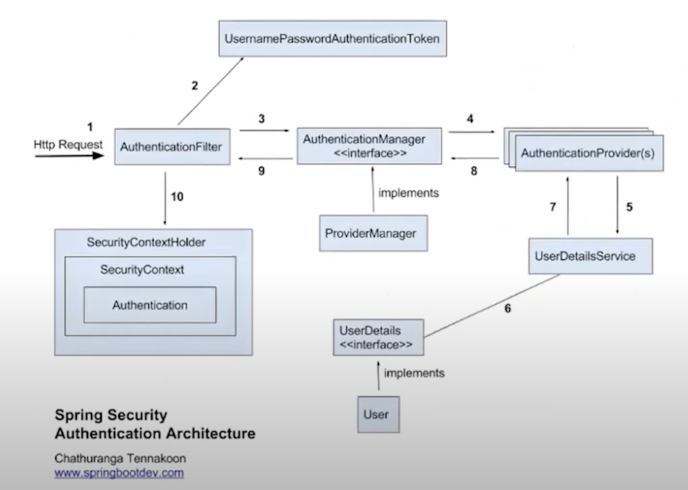
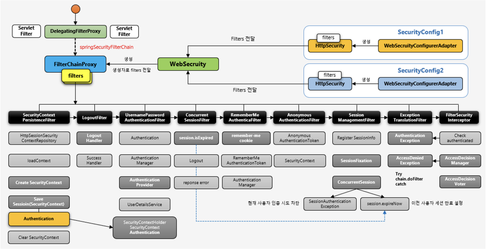

# Spring Security

스프링 시큐리티는 스프링 프로젝트 중에 가장 많이 사용되는 프로젝트이다.  
스프링을 해봤다고 한다면 기본적으로 Spring Web => Spring Data => Spring Security이다.  

## Spring Security Servlet

스프링 시큐리티는 서블릿 버전과 WebFlux 버전으로 나뉜다.  
우리는 WebFlux를 학습한 적이 없기에 일단 Servlet 버전으로 학습한다.

기본적으로 스프링 시큐리티는 서블릿 필터 위에서 동작한다.

실제적으로 스프링의 필터는 DelegatingFilterProxy라는 이름으로 구현되어 있고, 서블릿 컨테이너의 라이프 사이클과 스프링 어플리케이션 컨텍스트의 라이프 사이클을 연동하는 역할을 한다.

실제 시큐리티 동작은 SecurityFilterChain을 가지고 있으며, 여러 SecurityFilter들로 구성된다.

## Authentication vs Authorization

인증과 인가를 의미한다. 해당 내용도 상세하게 살펴봐야 하지만 간단하게 아래와 같이 생각해볼 수 있다.   
인증이란? 유저가 누구인지 확인하는 절차, 회원가입하고 로그인 하는 것.  
인가란? 유저에 대한 권한을 허락하는 것.  
스프링 시큐리티는 인증과 인가를 모두 제공한다.

## 기본적인 로그인 인증 구조

## 스프링 시큐리티 주요 필터

[링크](https://catsbi.oopy.io/f9b0d83c-4775-47da-9c81-2261851fe0d0)