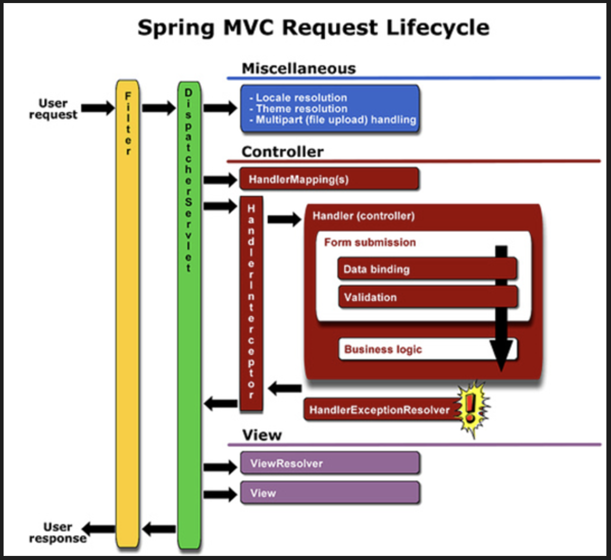

# Exception Handling

API 응답은 헤테로지니어스 하다고 한다. 타입이 하나로 결정되지 않고, 정상 응답이 올 경우, 오류가 올경우 형태가 다르기 떄문이다.

## ControllerAdvice

가장 일반적으로 오류를 처리하는 방식이다.

ControllerAdvice가 동작하는 순서는 다음과 같다.

1. 디스패처 서블릿이 에러를 catch함
2. 해당 에러를 처리할 수 있는 처리기(HandlerExceptionResolver)가 에러를 처리함
3. 컨트롤러의 ExceptionHandler로 처리가능한지 검사함
4. ControllerAdvice의 ExceptionHandler로 처리가능한지 검사함
5. ControllerAdvice의 ExceptionHandler 메소드를 invoke하여 예외를 반환함

[출처](https://mangkyu.tistory.com/246)

구현의 가장 일반적인 예는 다음과 같다. 모든 Exception을 처리하되, 우리가 정의한 DomainException의 경우 400, 그렇지 않을 경우 500을 리턴한다.  
왜 이렇게 할까? 알반적인 예로 400은 의도된 오류이므로, 사용자에게 안내 메시지가 나가고, 500의 경우 message를 활용하지 않는 등의 전략을 사용할 수 있기 때문에 이렇게 Method를 구별하기도 한다.

```java
@ControllerAdvice
public class ExceptionHandler {
    @org.springframework.web.bind.annotation.ExceptionHandler(DomainException.class)
    public ResponseEntity<ExceptionMessage> handle(Throwable throwable) {
        return new ResponseEntity(
                new ExceptionMessage(throwable.getMessage()),
                HttpStatus.BAD_REQUEST
        );
    }

    @org.springframework.web.bind.annotation.ExceptionHandler(Exception.class)
    public ResponseEntity<ExceptionMessage> handleUnexpectedException(Throwable throwable) {
        return new ResponseEntity(
                new ExceptionMessage(throwable.getMessage()),
                HttpStatus.INTERNAL_SERVER_ERROR
        );
    }
}

```

그러면 DomainException을 별도로 정의하고 EmailShouldBeNotNullException로 해당 예외를 상속하도록 하자.

```java
public class DomainException extends RuntimeException {
    public DomainException(String message) {
        super(message);
    }
}
```

```java
public class EmailShouldBeNotNullException extends DomainException {
    public EmailShouldBeNotNullException() {
        super("이메일은 반드시 입력해야 됩니다.");
    }
}
```

## HandlerInterceptor

항상 ControllerAdvice가 나오면 따라 나오는 질문이 HandlerInterceptor이다.  
HandlerInterceptor는 Controller 실행 전후에 다양한 기능을 추가할 수 있다.  

afterCompletion을 활용하면 Exception 처리가 가능하긴 하지만 너무 많은 기능을 가진 response가 열려 있고 ControllerAdvice랑 보통 사용법은 더욱 단순한 ControllerAdvice에서 오류처리를 일반적으로 한다.
특정 URL의 공통처리등을 위해서 많이 사용된다.



```java
public class CustomInterceptor implements HandlerInterceptor {
    @Override
    public boolean preHandle(HttpServletRequest request, HttpServletResponse response, Object handler) throws Exception {

        return true;
    }

    @Override
    public void postHandle(HttpServletRequest request, HttpServletResponse response, Object handler, ModelAndView modelAndView) throws Exception {
    }

    @Override
    public void afterCompletion(HttpServletRequest request, HttpServletResponse response, Object handler, Exception ex) throws Exception {
        if (ex instanceof Exception) {
            throw new IllegalStateException();
        }
    }
}
```

```java
@Configuration
public class WebConfig implements WebMvcConfigurer {
    @Override
    public void addInterceptors(InterceptorRegistry registry) {
        registry.addInterceptor(new CustomInterceptor());
    }
}
```